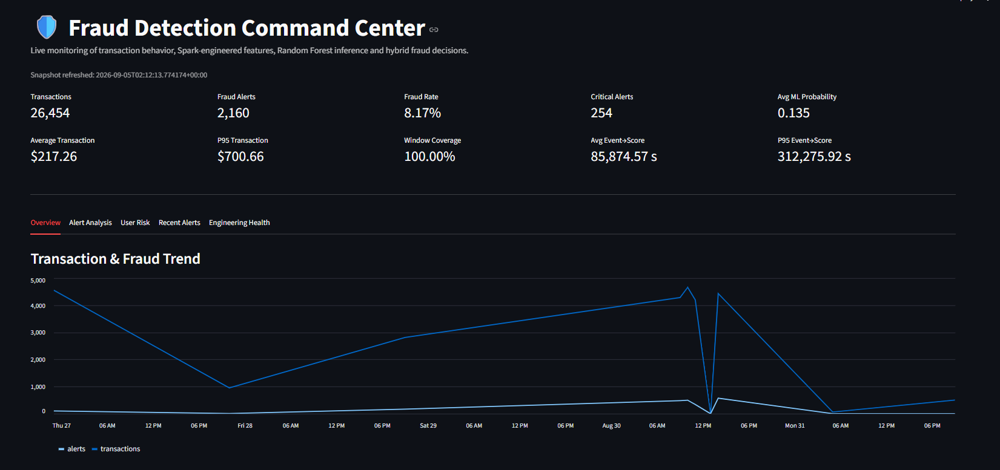
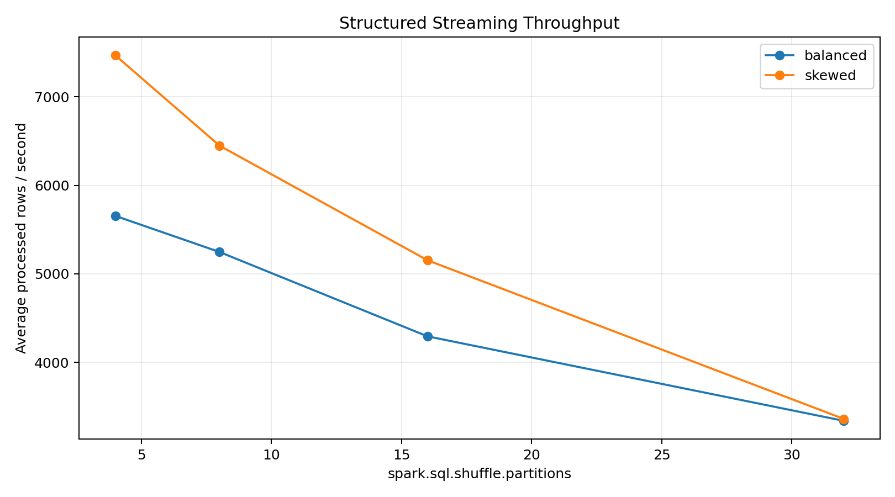
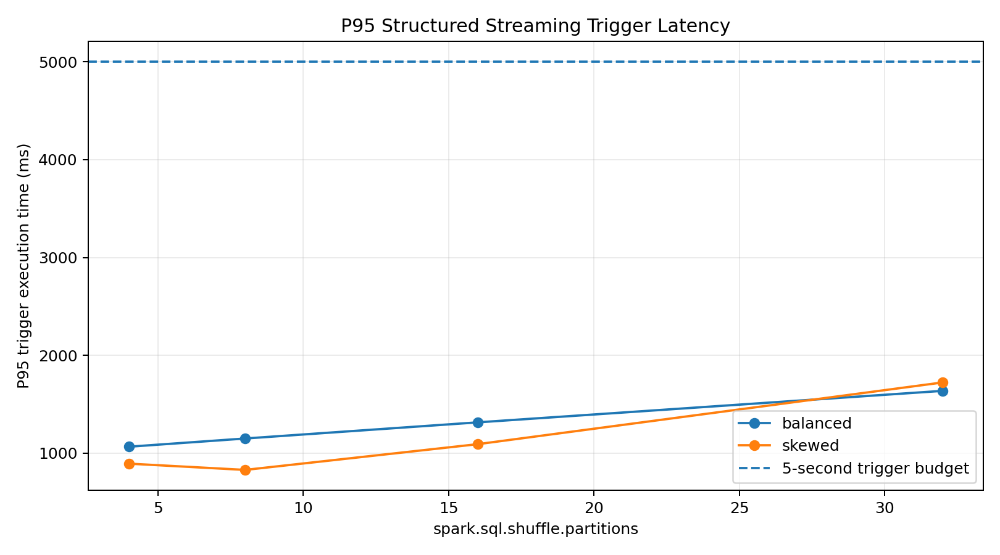
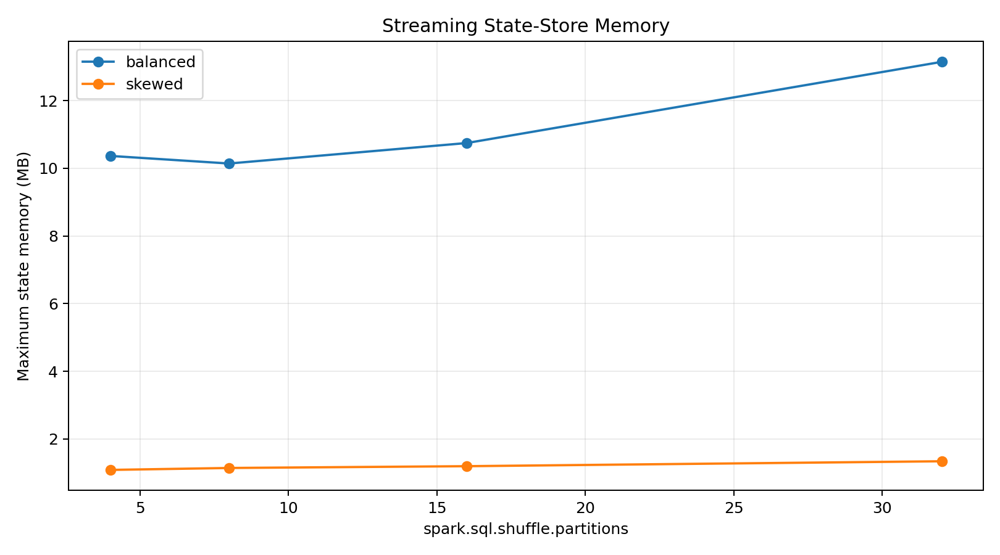

# Real-Time Financial Fraud Detection Lakehouse

    A portfolio-grade real-time fraud-detection platform built
    with **Apache Kafka, PySpark Structured Streaming, Delta Lake,
    Spark MLlib, Docker and Streamlit**.

    The project focuses on advanced distributed-streaming
    engineering rather than a simple static machine-learning
    notebook.

    It combines:

    - event-time processing,
    - watermarks,
    - sliding windows,
    - arbitrary per-user state,
    - online behavioral statistics,
    - fraud-rule engineering,
    - distributed Random Forest inference,
    - Delta Lake reliability,
    - checkpoint recovery,
    - idempotent writes,
    - performance benchmarking,
    - Spark observability,
    - and a live fraud-monitoring dashboard.

    ---

    ## Platform Preview

    

    The dashboard presents the business-facing output of the
    underlying Kafka → PySpark → Delta Lake → ML streaming platform.

    [View the full demo gallery](docs/demo_gallery.md)

    ---

    ## Demo

    Start the complete local demonstration:

    ```powershell
    docker compose -f docker\docker-compose.yml --profile demo up -d
    ```

    Then open:

    **Fraud Command Center**

    `http://localhost:8501`

    **Spark History Server**

    `http://localhost:18080`

    ---

    ## Architecture

    ```mermaid
    flowchart LR

        P["Transaction Generator"]
        K[("Kafka")]

        B["Bronze Stream"]
        BD[("Bronze Delta")]

        Q["Quality + Dedupe"]
        SD[("Silver Delta")]
        X[("Quarantine")]

        W["10m Sliding Windows<br/>2m Slide"]
        S["applyInPandasWithState<br/>Per-User History"]

        WF[("Window Features")]
        SF[("Stateful Features")]

        F["Hybrid Feature Assembly"]
        FE[("Immutable Gold<br/>Feature Events")]

        M[("Random Forest<br/>PipelineModel")]
        I["Distributed ML Inference"]
        H["Hybrid Final Decision"]

        T[("Scored Transactions")]
        A[("Fraud Alerts")]

        D["Streamlit Dashboard"]

        P --> K
        K --> B
        B --> BD

        BD --> Q
        Q --> SD
        Q --> X

        SD --> W
        SD --> S

        W --> WF
        S --> SF

        WF --> F
        SF --> F

        F --> FE

        FE --> I
        M --> I

        I --> H

        H --> T
        H --> A

        T --> D
        A --> D
    ```

    A deeper architecture explanation is available in
    [`docs/architecture.md`](docs/architecture.md).

    ---

    # Why PySpark?

    Fraud detection is naturally both stateful and time-sensitive.

    A transaction may appear ordinary in isolation while becoming
    suspicious when compared with:

    - the user's historical spending behavior,
    - transactions during the last ten minutes,
    - device changes,
    - transaction frequency,
    - merchant diversity,
    - and statistical deviation from previous activity.

    PySpark Structured Streaming provides distributed primitives
    for maintaining these behaviors while processing event-time
    data continuously.

    ---

    # Advanced Spark Techniques Demonstrated

    ## Event-time processing

    The system processes the transaction's event timestamp rather
    than relying only on ingestion time.

    A **5-minute watermark** controls late-event state retention.

    ## Sliding windows

    Behavioral features use:

    - window duration: **10 minutes**
    - slide interval: **2 minutes**
    - watermark: **5 minutes**

    This produces overlapping behavioral contexts.

    ## Stateful deduplication

    Transaction IDs are deduplicated within the event-time
    watermark boundary.

    ## Arbitrary user state

    The project uses:

    `applyInPandasWithState`

    to maintain one persistent behavior state per user.

    State contains:

    - historical count,
    - historical mean,
    - statistical variance state,
    - last event timestamp,
    - previous device,
    - device-change count.

    ## Online statistics

    Welford's incremental algorithm maintains mean and sample
    variance in constant state size.

    This avoids storing every historical transaction for every
    user.

    ## Delta Lake

    Delta tables are used across Bronze, Silver and Gold layers.

    The project demonstrates:

    - ACID commits,
    - streaming reads and writes,
    - Delta MERGE,
    - partitioned Gold outputs,
    - transaction-level idempotency.

    ---

    # Medallion Architecture

    ## Bronze

    Preserves raw Kafka information including:

    - raw JSON,
    - topic,
    - partition,
    - offset,
    - Kafka timestamp,
    - headers,
    - ingestion timestamp.

    ## Silver

    Provides:

    - validated transactions,
    - watermarked deduplication,
    - quarantine for invalid transactions,
    - sliding-window behavioral features,
    - arbitrary historical user features.

    ## Gold

    Provides:

    - immutable fraud feature events,
    - final scored transactions,
    - final fraud alerts,
    - monitoring-ready serving outputs.

    ---

    # Fraud Detection Logic

    The rule engine evaluates signals including:

    1. historical amount anomaly,
    2. statistical z-score anomaly,
    3. amount-to-history ratio,
    4. elevated 10-minute transaction velocity,
    5. multiple-device activity,
    6. device change combined with amount deviation,
    7. merchant diversity,
    8. rapid repeat transactions.

    These signals generate a weighted fraud-rule score.

    ---

    # Machine Learning

    The ML layer uses a Spark MLlib **Random Forest**.

    The training pipeline includes:

    - boolean-to-numeric feature preparation,
    - median imputation,
    - merchant-category indexing,
    - one-hot encoding,
    - vector assembly,
    - class weighting,
    - Random Forest classification.

    Training and evaluation use a **temporal split** rather than a
    random train/test split.

    This prevents future observations from being randomly mixed
    into earlier training data.

    ## Measured Model Metrics

    | Metric | Result |
    |---|---:|
    | ROC-AUC | 0.9772 |
    | PR-AUC | 0.7027 |
    | Precision | 0.6526 |
    | Recall | 0.6739 |
    | F1 | 0.6631 |
    | Accuracy | 0.9641 |
    | True Positives | 62 |
    | False Positives | 33 |
    | False Negatives | 30 |
    | True Negatives | 1,628 |

    These values are read from the project's generated model
    evaluation output rather than hard-coded into this README.

    ---

    # Hybrid Final Decision

    The production decision is not simply:

    `Random Forest prediction = fraud`

    Instead, the final engine combines model probability and
    deterministic behavioral rules.

    Example decision paths include:

    - high-confidence ML detection,
    - rule anomaly confirmed by ML,
    - critical rule-score escalation.

    Final output includes:

    - fraud flag,
    - severity,
    - decision basis,
    - fraud reasons,
    - ML probability,
    - rule score.

    ---

    # Performance Engineering

    The project benchmarks:

    - 4 shuffle partitions,
    - 8 shuffle partitions,
    - 16 shuffle partitions,
    - 32 shuffle partitions.

    Tests are performed using both:

    - balanced user traffic,
    - deliberate hot-key traffic where 90% of records belong to
      one user.

    Selection considers:

    - processing throughput,
    - P95 trigger latency,
    - trigger-budget compliance,
    - state-store memory.

    The measured local recommendation is **4 shuffle partitions**.

    **Baseline configuration:** 8

    **Measured worst-profile P95 trigger:** 1066.00 ms

    **Minimum measured throughput headroom:** 5.655

    **Maximum measured state memory:** 10.36 MB

    ## Benchmark Results

    | Workload | Shuffle partitions | Processed rows/s | P95 trigger ms | Max state memory MB |
|---|---:|---:|---:|---:|
| balanced | 4 | 5,655.23 | 1,066.00 | 10.36 |
| balanced | 8 | 5,247.84 | 1,150.00 | 10.14 |
| balanced | 16 | 4,294.62 | 1,315.00 | 10.74 |
| balanced | 32 | 3,340.28 | 1,637.00 | 13.14 |
| skewed | 4 | 7,468.76 | 893.00 | 1.09 |
| skewed | 8 | 6,449.53 | 829.00 | 1.14 |
| skewed | 16 | 5,154.06 | 1,092.00 | 1.20 |
| skewed | 32 | 3,361.93 | 1,723.00 | 1.34 |

    Detailed analysis:

    [`docs/performance/benchmark_summary.md`](docs/performance/benchmark_summary.md)

    ### Throughput

    

    ### P95 Trigger Latency

    

    ### State-Store Memory

    

    ---

    # Handling Data Skew

    The benchmark intentionally demonstrates why simply increasing
    `spark.sql.shuffle.partitions` cannot solve every skew problem.

    A single hot `user_id` remains one logical grouping key.

    The arbitrary historical state therefore deliberately does
    **not** salt `user_id`, because doing so would create multiple
    independent fraud histories for the same person.

    The project instead uses:

    - benchmark-driven shuffle tuning,
    - bounded streaming ingestion,
    - event-time state expiration,
    - hot-key profiling,
    - user-key Kafka partitioning.

    ---

    # Reliability

    Reliability mechanisms include:

    - Spark checkpoints,
    - state-store recovery,
    - Kafka replay,
    - Delta ACID transactions,
    - idempotent Delta writes,
    - Docker restart policies,
    - transaction quarantine.

    ## Recovery testing

    The project includes an integration test that:

    1. processes an initial event set,
    2. stops the streaming query,
    3. adds new data,
    4. restarts with the same checkpoint,
    5. verifies continuation without duplicating previous output.

    Another integration test verifies retry-safe Delta writes using
    the same transaction application ID and transaction version.

    See:

    [`docs/reliability.md`](docs/reliability.md)

    ---

    # Observability

    ## StreamingQueryListener

    Every active Spark stream records structured progress metrics
    including:

    - input rows,
    - processing rate,
    - trigger execution duration,
    - query planning,
    - state rows,
    - state-store memory,
    - watermark drops,
    - source offsets.

    ## Spark History Server

    Spark event logs are persisted for post-run inspection.

    Open:

    `http://localhost:18080`

    This exposes:

    - jobs,
    - stages,
    - tasks,
    - executors,
    - SQL plans,
    - shuffle activity,
    - Spark configuration.

    ---

    # Fraud Monitoring Dashboard

    The project includes a separate Streamlit monitoring service.

    Open:

    `http://localhost:8501`

    The dashboard displays:

    - transactions processed,
    - fraud alerts,
    - fraud rate,
    - critical alerts,
    - average ML probability,
    - severity distribution,
    - fraud-decision basis,
    - high-risk users,
    - recent alerts,
    - window-feature coverage,
    - event-to-score latency.

    ## Dashboard Screenshots

    Screenshots can be placed in:

    `docs/screenshots/`

    The dashboard is intentionally separated from the Spark
    processing image so visualization dependencies do not need to
    be installed into every Spark service.

    ---

    # Testing

    Run all tests:

    ```powershell
    docker exec -it fraud-spark-dev python -m pytest tests -v
    ```

    Test coverage includes:

    - Welford incremental statistics,
    - transaction-quality rules,
    - final fraud-decision logic,
    - checkpoint recovery,
    - Delta idempotency.

    ---

    # Docker Quick Start

    ## Start the processing platform

    ```powershell
    docker compose -f docker\docker-compose.yml up -d
    ```

    ## Start the complete demo

    ```powershell
    docker compose -f docker\docker-compose.yml --profile demo up -d
    ```

    ## Show service status

    ```powershell
    docker compose -f docker\docker-compose.yml ps -a
    ```

    ## Watch final scoring

    ```powershell
    docker compose -f docker\docker-compose.yml logs -f final-scoring-stream
    ```

    ## Shut down

    ```powershell
    docker compose -f docker\docker-compose.yml down
    ```

    ---

    # Repository Structure

    ```text
    real-time-fraud-detection/
    │
    ├── checkpoints/
    │
    ├── config/
    │
    ├── data/
    │   ├── bronze/
    │   ├── silver/
    │   ├── gold/
    │   ├── quarantine/
    │   ├── training/
    │   ├── monitoring/
    │   └── benchmarks/
    │
    ├── docker/
    │   ├── spark/
    │   ├── dashboard/
    │   └── docker-compose.yml
    │
    ├── docs/
    │   ├── architecture.md
    │   ├── data_contract.md
    │   ├── demo_guide.md
    │   ├── engineering_decisions.md
    │   ├── reliability.md
    │   ├── performance/
    │   └── screenshots/
    │
    ├── models/
    │
    ├── scripts/
    │
    ├── src/
    │   ├── common/
    │   ├── producer/
    │   ├── streaming/
    │   ├── features/
    │   ├── state/
    │   ├── ml/
    │   ├── quality/
    │   ├── monitoring/
    │   └── dashboard/
    │
    └── tests/
        ├── unit/
        ├── integration/
        └── performance/
    ```

    ---

    # Key Engineering Decisions

    Detailed decisions are documented in:

    [`docs/engineering_decisions.md`](docs/engineering_decisions.md)

    Some of the most important are:

    - labels never enter the production Kafka payload,
    - historical state is calculated before updating it with the
      current transaction,
    - user state is not salted,
    - MERGE-maintained training snapshots are separated from
      immutable serving events,
    - performance settings are benchmarked rather than guessed,
    - Spark execution metrics and business-facing monitoring are
      treated as different observability layers.

    ---

    # Data Contract

    Kafka and final-serving contracts are documented in:

    [`docs/data_contract.md`](docs/data_contract.md)

    ---

    # Recruiter Demo Guide

    A short guided demo sequence is available in:

    [`docs/demo_guide.md`](docs/demo_guide.md)

    ---

    # Interview Talking Points

    This project can support discussions around:

    ### Structured Streaming

    - event time vs processing time,
    - watermarks,
    - sliding windows,
    - output modes,
    - micro-batch processing,
    - stream-stream/state semantics.

    ### Stateful processing

    - arbitrary user state,
    - state timeouts,
    - out-of-order events,
    - incremental statistics,
    - state-store memory,
    - hot-key behavior.

    ### Spark performance

    - shuffle partitions,
    - skew,
    - throughput vs latency,
    - state-memory trade-offs,
    - Spark History Server,
    - benchmark methodology.

    ### Reliability

    - checkpoint recovery,
    - idempotency,
    - ACID Delta commits,
    - replay,
    - failure isolation.

    ### Machine learning

    - label leakage,
    - class imbalance,
    - temporal validation,
    - distributed feature engineering,
    - hybrid rules + ML.

    ### Data platform design

    - medallion architecture,
    - immutable serving events,
    - quarantine,
    - separation of training and serving concerns,
    - observability.

    ---

    # Documentation

    - [Architecture](docs/architecture.md)
    - [Engineering Decisions](docs/engineering_decisions.md)
    - [Reliability](docs/reliability.md)
    - [Data Contract](docs/data_contract.md)
    - [Demo Guide](docs/demo_guide.md)
    - [Performance Benchmark](docs/performance/benchmark_summary.md)
    - [Demo Gallery](docs/demo_gallery.md)
    - [Portfolio / Recruiter Copy](docs/portfolio_pitch.md)

    ---

    ## Project Status

    Portfolio implementation includes:

    - real-time ingestion,
    - distributed streaming,
    - stateful feature engineering,
    - ML training,
    - online inference,
    - hybrid fraud decisions,
    - Delta Lake serving,
    - tests,
    - recovery,
    - observability,
    - benchmarking,
    - Docker orchestration,
    - recruiter-facing monitoring.
