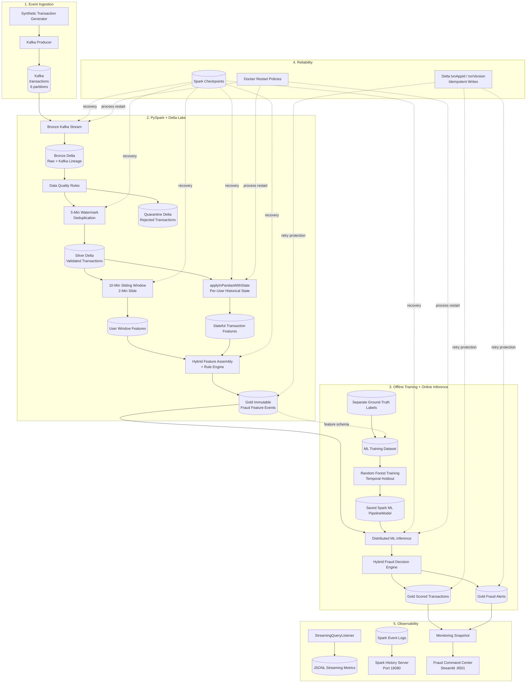

# System Architecture

## Real-Time Financial Fraud Detection Lakehouse

This project demonstrates a stateful financial fraud-detection
platform built around Apache Kafka, PySpark Structured Streaming,
Delta Lake and Apache Spark MLlib.

The architecture intentionally separates:

- ingestion,
- data quality,
- event-time analytics,
- persistent per-user state,
- machine-learning inference,
- final fraud decisions,
- reliability,
- observability,
- and presentation.

---

## High-Level Architecture

---

## Streaming Data Flow

### 1. Kafka ingestion

The transaction generator creates synthetic financial
transactions containing:

- transaction ID,
- user ID,
- event timestamp,
- amount,
- merchant category,
- device ID.

Fraud labels remain outside Kafka. This prevents the live
pipeline from receiving information it would not possess in
a real production system.

Kafka records are keyed by `user_id`, improving locality for
user-oriented downstream processing.

---

### 2. Bronze layer

The Bronze stream preserves the original transaction together
with Kafka lineage:

- topic,
- partition,
- offset,
- Kafka timestamp,
- headers,
- raw JSON,
- ingestion timestamp.

Bronze therefore provides replayability and traceability.

---

### 3. Silver quality layer

Transactions are validated for conditions including:

- malformed JSON,
- missing identifiers,
- missing timestamps,
- invalid amounts,
- excessive amounts,
- missing merchant or device information,
- timestamps too far in the future.

Valid records continue to Silver.

Invalid records are written to a separate quarantine Delta
table with explicit rejection reasons.

A five-minute event-time watermark supports bounded
transaction-ID deduplication.

---

### 4. Sliding-window features

Silver transactions feed a stateful Structured Streaming
aggregation using:

- 10-minute windows,
- 2-minute slide,
- 5-minute watermark.

Features include:

- transaction count,
- total spending,
- average amount,
- maximum and minimum amount,
- amount standard deviation,
- transaction velocity,
- device diversity,
- merchant diversity.

Because this is a sliding window, one transaction can
participate in multiple overlapping windows.

---

### 5. Arbitrary per-user state

A separate processing path uses:

`applyInPandasWithState`

to maintain long-lived behavior for every user.

State includes:

- historical transaction count,
- incremental mean,
- incremental variance state,
- previous event time,
- previous device,
- device-change count.

Welford's online algorithm allows mean and sample standard
deviation to be updated without storing each user's entire
transaction history.

Historical anomaly detection compares each new transaction
against state **before** that transaction updates the state.

---

### 6. Hybrid feature assembly

Transaction-level historical features are enriched with the
applicable sliding-window features.

The rule engine evaluates signals such as:

- historical amount deviation,
- statistical z-score,
- high transaction velocity,
- multiple-device activity,
- changed-device plus amount anomaly,
- merchant diversity,
- rapid repeat activity.

The resulting feature event is written to an immutable Gold
Delta table suitable for downstream serving.

---

### 7. Machine learning

Training labels are stored separately from the live Kafka
payload.

Spark MLlib trains a Random Forest pipeline using:

- class weighting,
- median imputation,
- categorical indexing,
- one-hot encoding,
- vector assembly,
- temporal train/test separation.

The full `PipelineModel` is persisted and later loaded once
by the live scoring application.

---

### 8. Final fraud decision

The final decision combines:

- Random Forest probability,
- rule score,
- rule-based anomaly status.

Possible decision paths include:

- high-confidence ML detection,
- rule + ML confirmation,
- exceptionally high rule score.

The serving layer produces:

- all scored transactions,
- fraud alerts,
- final severity,
- final decision basis,
- human-readable fraud reasons.

---

## Reliability Architecture

Reliability is handled at several layers:

1. Kafka offsets provide replayable ingestion.
2. Spark checkpoints preserve streaming progress.
3. Stateful checkpoints preserve operator state.
4. Delta Lake provides ACID table commits.
5. `txnAppId` and `txnVersion` protect retry-sensitive writes.
6. Docker restart policies restart failed applications.
7. Integration tests verify checkpoint continuation.

---

## Observability Architecture

Two different levels of Spark observability are retained.

### Streaming-level metrics

`StreamingQueryListener` records:

- input rows,
- processing rate,
- trigger duration,
- query-planning duration,
- state rows,
- state memory,
- rows dropped by watermark,
- source offsets.

### Spark execution metrics

Spark event logs are persisted and exposed through the Spark
History Server.

This supports post-run inspection of:

- jobs,
- stages,
- tasks,
- executors,
- shuffle reads,
- shuffle writes,
- SQL plans.

---

## Presentation Layer

The recruiter-facing Streamlit dashboard exposes:

- transaction volume,
- alert volume,
- fraud rate,
- severity distribution,
- ML probabilities,
- decision basis,
- high-risk users,
- recent alerts,
- event-to-score latency,
- feature coverage.

The dashboard does not perform fraud scoring itself.

It reads committed Gold Delta snapshots produced by the
streaming platform.
