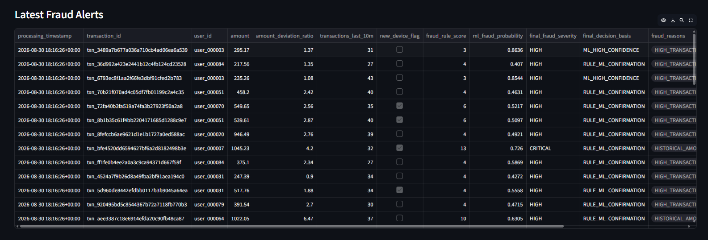
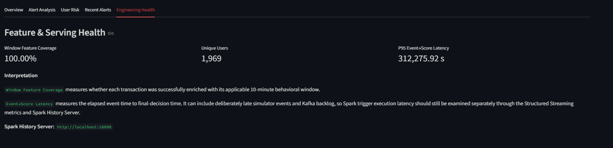
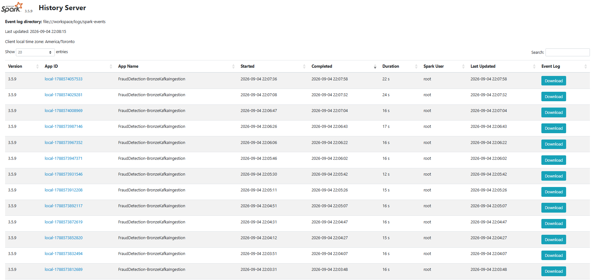

# Project Demo Gallery

## Fraud Detection Command Center

The Streamlit monitoring interface reads committed Gold Delta
outputs produced by the real-time fraud-detection pipeline.

The dashboard exposes transaction volume, alert volume, fraud
rate, ML risk, severity and recent processing trends.

---

## Fraud Investigation View

Each alert can be investigated using transaction-level behavioral
and model signals including:

- transaction amount,
- historical deviation,
- 10-minute transaction velocity,
- device behavior,
- fraud-rule score,
- Random Forest probability,
- final severity,
- final decision basis.

---

## Engineering Health

The presentation layer also exposes engineering-oriented
indicators such as feature-enrichment coverage and event-to-score
latency.

---

## Spark Execution Evidence

Spark event logs are persisted and exposed through the Spark
History Server, allowing post-run inspection of jobs, stages,
tasks, executors and shuffle activity.